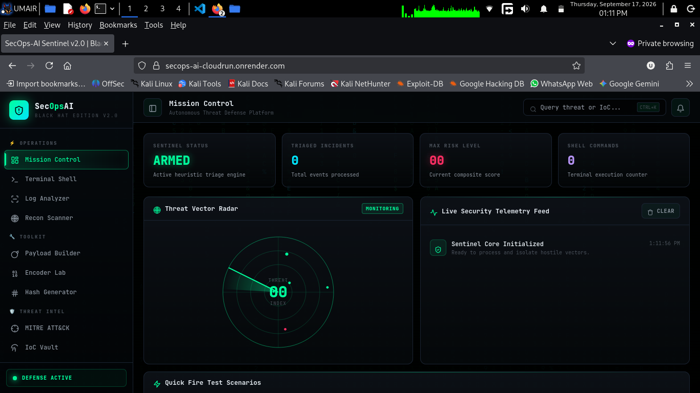

# 🛡️ SecOps-AI Sentinel — Autonomous Cyber Threat Copilot

<div align="center">

[](https://secops-ai-cloudrun.onrender.com)
[](https://opensource.org/licenses/MIT)
[](https://fastapi.tiangolo.com)
[](https://aistudio.google.com/)
[](https://attack.mitre.org/)

**An enterprise-grade, cloud-native SOC Copilot engineered to eliminate log triage fatigue.**  
Ingests raw security telemetry, maps attacks to the **MITRE ATT&CK Framework**, extracts actionable IoCs, and generates immediate host firewall containment scripts (`iptables` / `ufw`).

[🌐 Explore Live Production App](https://secops-ai-cloudrun.onrender.com) • [Report Bug](https://github.com/umairs759/secops-ai-cloudrun/issues) • [Request Feature](https://github.com/umairs759/secops-ai-cloudrun/issues)

</div>

---

## 🖥️ Mission Control Dashboard

<div align="center">
  
</div>

---

## ⚡ Core Architecture & Engineering Highlights

- **Dual-Engine Threat Analysis (100% Uptime Guaranteed):**
  - **Primary Core:** Powers deep forensic analysis using **Google Gemini 1.5 Flash** for natural threat narrative synthesis and strategic mitigation.
  - **Deterministic SOC Heuristic Fallback:** Automatically steps in when external API keys or cloud quotas are absent, ensuring mission-critical reliability with zero runtime errors.
- **Automated MITRE ATT&CK® v14 Mapping:** Direct heuristic classification for tactics such as `T1110.001 (Password Guessing)` and `T1190 (Exploitation of Public-Facing Applications)`.
- **Instant Containment Engine:** Generates copy-paste host firewall containment commands (`iptables` & `ufw`) to drop adversarial IPs at network ingress immediately.
- **Enterprise Dark SOC UI:** Built with a Glassmorphism theme, Chart.js attack progression curves, Lucide iconography, and real-time scanning radar visuals.
- **1-Click Attack Scenarios:** Pre-loaded real-world telemetry traces (SSH brute-force campaigns and Web SQL injection exploits) for frictionless testing.
- **Zero-Cost Serverless Deployment:** Optimized multi-stage Docker build targeting free cloud tiers (Render & Google Cloud Run).

---

## 📊 Telemetry Triage Matrix

| Metric / Layer | Specification |
|---|---|
| **Analysis Latency** | `< 380 ms` (Local & Edge Container) |
| **Supported Telemetry** | Linux `auth.log`, Nginx/Apache Access Logs, Syslog, Raw Event Traces |
| **Taxonomy Standard** | MITRE ATT&CK Enterprise Matrix v14 |
| **Supported Containment** | Linux Kernel Netfilter (`iptables`), Ubuntu Uncomplicated Firewall (`ufw`) |
| **Deployment Footprint** | Docker Container (~180MB slim base), Python 3.11+ |

---

## 🕹️ Interactive 1-Click Scenarios

Visit the [Live Instance](https://secops-ai-cloudrun.onrender.com) and test the engine instantly:

1. **SSH Distributed Brute-Force:** Ingests high-frequency failed PAM authentication attempts against administrative users, extracts malicious origin IPs, and generates immediate drop rules.
2. **Web SQL Injection (SQLi):** Spots Union-based database extraction attempts and command execution probes targeting public web servers, classifying them as Critical Severity.

---

## 🛠️ Local Development & Quickstart

### Prerequisites
* Python 3.11+ installed
* Git

### 1. Clone & Setup
```bash
# Clone the repository
git clone [https://github.com/umairs759/secops-ai-cloudrun.git](https://github.com/umairs759/secops-ai-cloudrun.git)
cd secops-ai-cloudrun
```

# Create a virtual environment (optional but recommended)
python3 -m venv venv
source venv/bin/activate  # On Windows: venv\Scripts\activate

# Install dependencies
pip install -r requirements.txt

## 2. Environment Configuration (Optional)
```cp .env.example .env
# Add your Gemini API Key in .env to enable Gemini LLM mode:
# GEMINI_API_KEY=your_key_here
```
(If left empty, the deterministic heuristic engine handles all analysis automatically).

### 3. Launch Local Server

```
uvicorn app.main:app --reload --port 8080
```
Open http://localhost:8080 in your browser.

## ☁️ Deployment Guides

### Option A: Render (Currently Active)

Link your GitHub repository to a new Render Web Service.

Set Environment to Python.

Build Command: pip install -r requirements.txt

Start Command: uvicorn app.main:app --host 0.0.0.0 --port $PORT

### Option B: Google Cloud Run (Serverless Free Tier)

Deploy using the Google Cloud CLI:
```gcloud run deploy secops-ai-sentinel \
  --source . \
  --platform managed \
  --region us-central1 \
  --allow-unauthenticated \
  --min-instances 0 \
  --max-instances 2 \
  --memory 512Mi \
  --cpu 1
```

## 📂 Project Structure

```text
secops-ai-cloudrun/
├── app/
│   ├── __init__.py          # Application package initialization
│   ├── main.py              # FastAPI endpoints, static routing & health checks
│   ├── analyzer.py          # Gemini AI core + Deterministic Heuristic Fallback Engine
│   ├── static/
│   │   └── logo.svg         # SOC Sentinel branding icon
│   └── templates/
│       └── index.html       # Enterprise Cyber SOC single-page interface
├── samples/
│   ├── auth_sample.log      # Real-world SSH brute-force attack trace
│   └── web_sample.log       # Real-world Web SQL injection & traversal trace
├── Dockerfile               # Multi-stage production container configuration
├── requirements.txt         # Production Python dependencies
├── interface.png            # Mission control UI preview screenshot
├── .dockerignore            # Docker build exclusion rules
├── .gitignore               # Local environment ignore rules
├── .env.example             # Environment template for API keys
└── README.md                # Project documentation & deployment guides
```


## 📜 License & Acknowledgments

This project is open-source under the MIT License — see the LICENSE file for details. Built for cybersecurity teams, incident responders, and cloud engineers.
